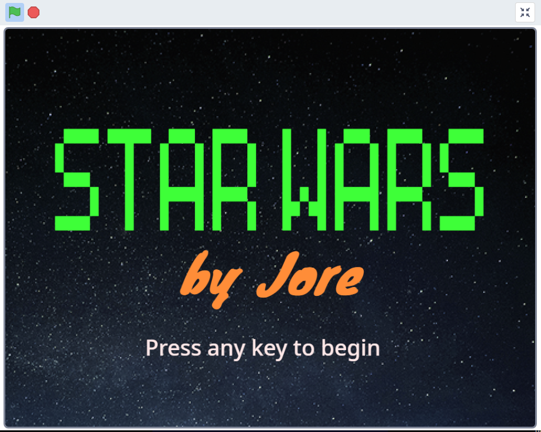
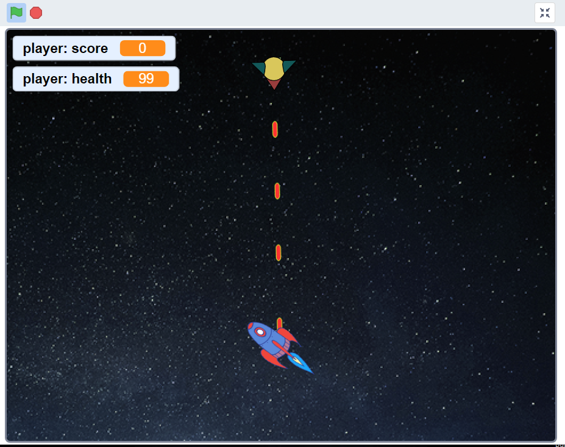
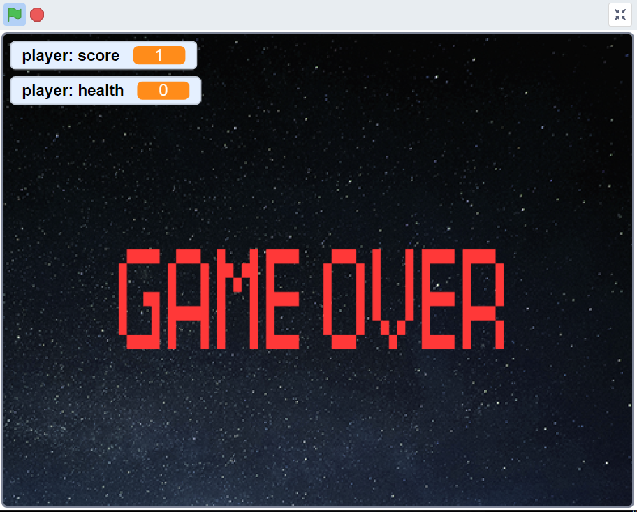
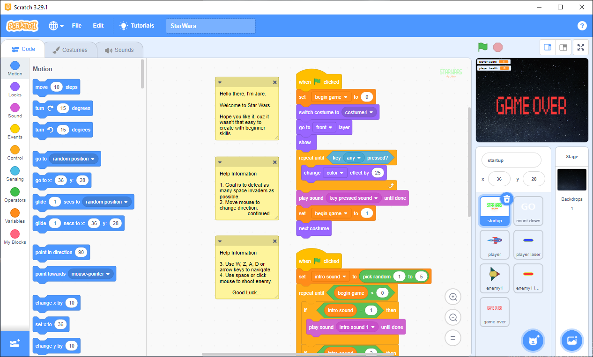

# STAR WARS

	
	
	

Star Wars game made in scratch.

  
  
  
  

# [PLAY NOW!](https://scratch.mit.edu/projects/902631310)

<iframe src="https://scratch.mit.edu/projects/902631310/embed" allowtransparency="true" width="485" height="402" frameborder="0" scrolling="no" allowfullscreen></iframe>
